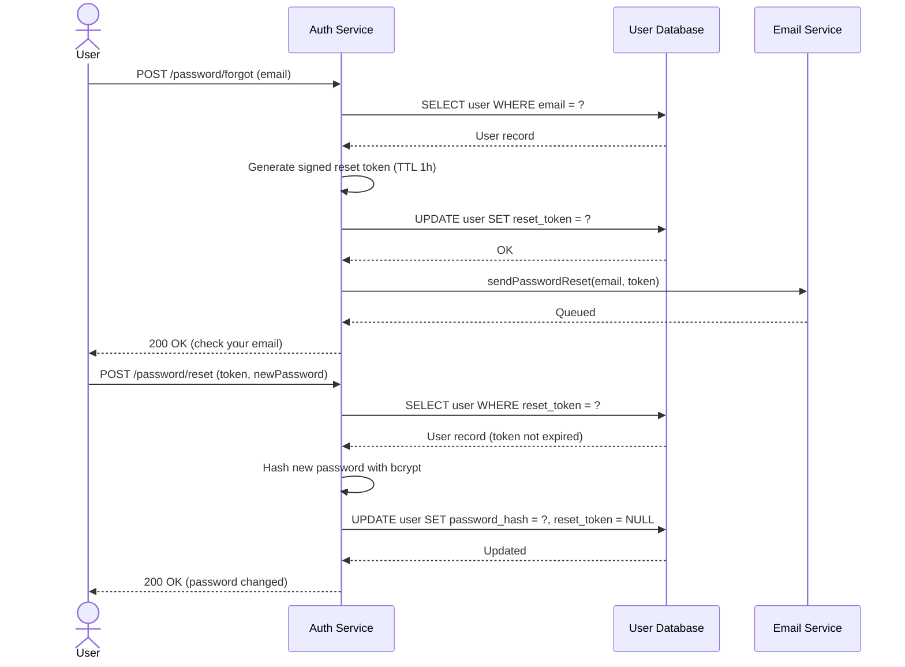
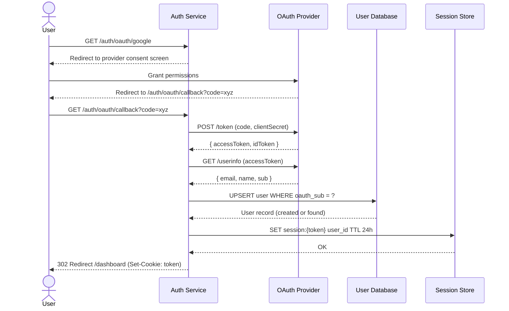

# Authentication Flows

This document covers the authentication-related flows: password reset and OAuth-based login via a third-party provider.

## Password Reset

The user requests a reset link, which is sent by the email service. The link contains a signed token that allows the user to set a new password without knowing the old one.

## OAuth Login

Allows users to log in using a third-party OAuth 2.0 provider (e.g. Google). The provider authenticates the user and returns an authorization code that the backend exchanges for a profile.

