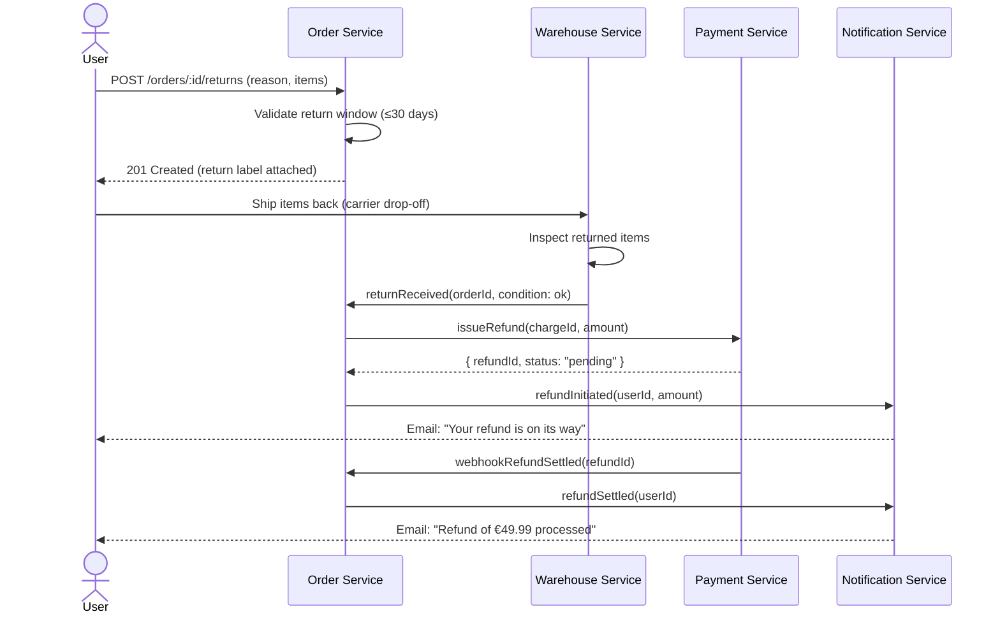
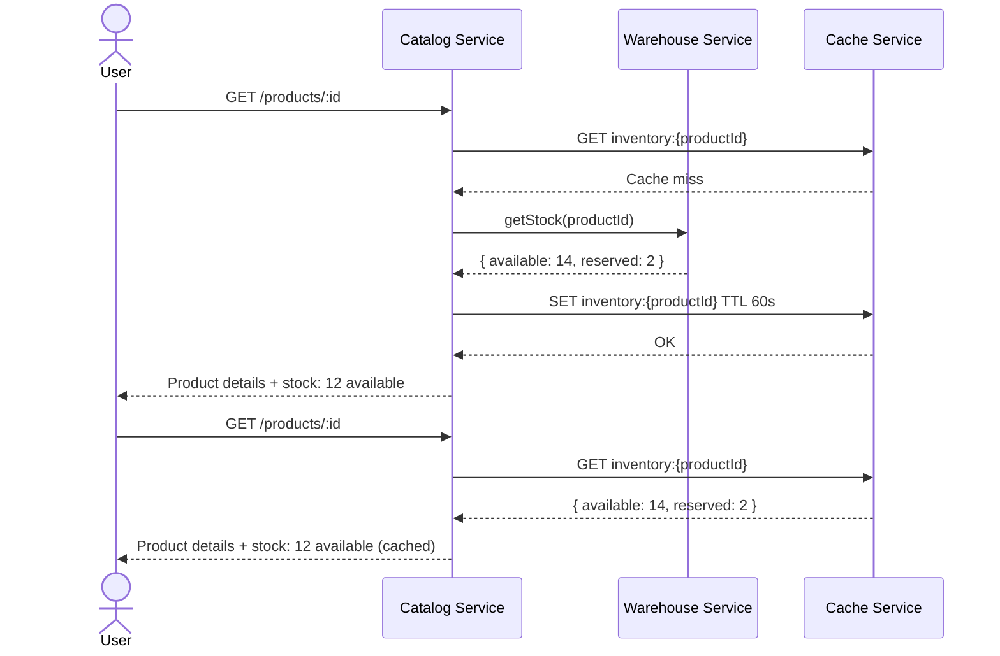
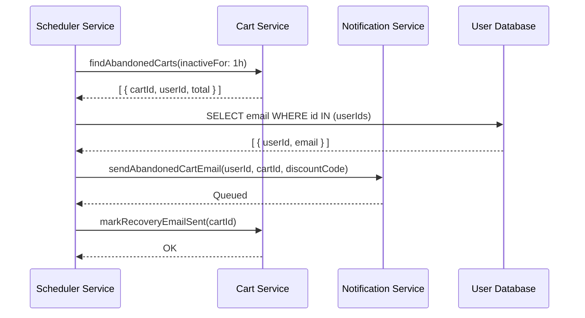

# Commerce Flows

Post-purchase flows: return requests and refund processing.

## Return Request

A customer initiates a return. The warehouse evaluates the item condition and the payment service issues a refund once the return is approved.

## Inventory Check

Called during product browsing to show real-time stock availability across warehouses before the user adds an item to the cart.

## Abandoned Cart Recovery

Triggered when a user leaves items in the cart without completing checkout. A scheduled job detects inactivity and the notification service sends a recovery email with a discount code.

